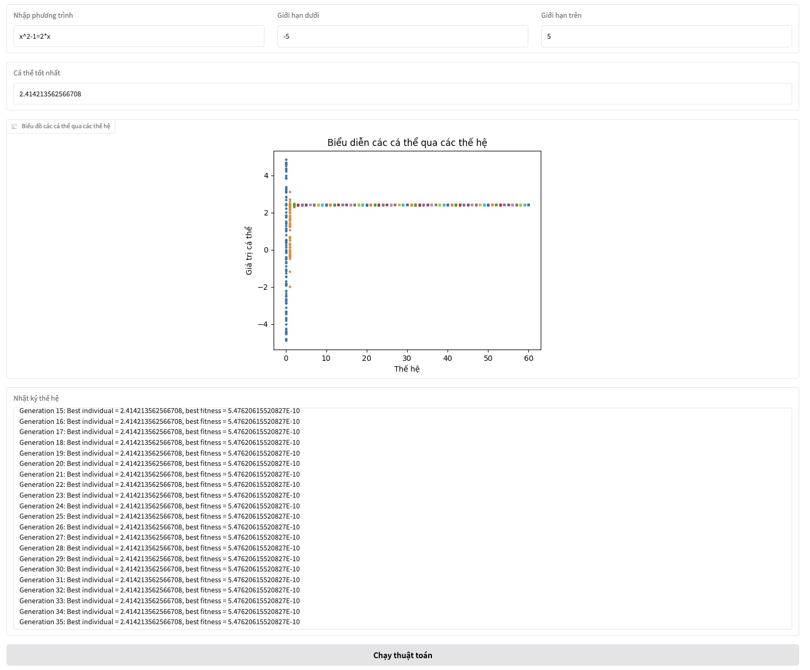

# Generic Algorithm in solving equation

## Introduction
This is a project for the course Project 1 - IT3150. The topic of the project is: Developing a Graphical Interface Program to simulate the Application of Genetic Algorithms in Solving Equations.

## Usage
Enter the equation string, the upper bound, and the lower bound of the solution interval. Then click 'Run Program'.

